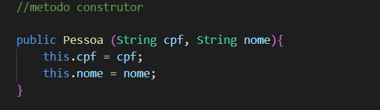

Construtores
Sabemos que, para criar um objeto na linguagem Java, utilizamos a seguinte estrutura de código:

Copy
Classe novoObjeto = new Classe();
Desta forma, será criado um novo objeto na memória, este recurso também é conhecido como instanciar um novo objeto.

Muitas vezes, já queremos que na criação (instanciação) de um objeto, a linguagem já solicite para quem for criar este novo objeto, defina algumas propriedades essenciais. Abaixo, iremos ilustrar uma classe Pessoa, onde a mesma terá os atributos: Nome, CPF e Endereço.

<h2>Pessoa.java</h2>

Nessa classe crio o objeto pessoa com os determinados atributos. Dessa vez ao invés do método setter uso o método construtor.

É uma boa pratica usar esse método para inserir somente os principais atributos de um objeto.

<h2>SistemaCadastro.java</h2>

No sistema iremos criar o novo objeto "marcos" , então chamo a classe Pessoa defino o nome da variável e ela receberá os parametros determinados no construtor 'nome' e 'cpf': 