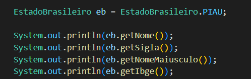

Enums
Enum, é um tipo especial de classe, onde os objetos são previamente criados, imutáveis e disponíveis por toda aplicação.

Usamos Enum, quando o nosso modelo de negócio contém objetos de mesmo contexto, que já existem de forma pré-estabelecida com a certeza de não haver tanta alteração de valores.

Exemplos:
Grau de Escolaridade: Analfabeto, Fundamental, Médio, Superior;

Estado Civil: Solteiro, Casado, Divorciado, Viúvo;

Estados Brasileiros: São Paulo, Rio de Janeiro, Piauí, Maranhão.

Não confunda uma lista de constantes com enum.

Enquanto que uma constante é uma variável de tipo com valor imutável, enum é um conjunto de objetos já pre-definidos na aplicação.

Como um enum é um conjunto de objetos, logo, estes objetos podem conter atributos e métodos. Veja o exemplo de um enum, para disponibilizar os quatro estados brasileiros citados acima, contendo informações de: Nome, Sigla e um método que pega o nome do de cada estado e já retorna para todo maiúsculo.

## Enums são criados para valores que não sofrem alterações com constancia, valores pré estabelecidos.

<h2>EstadoBrasileiro.java</h2>
Crio a public Enum com alguns estados brasileiros com os determinados valores, nome, sigla e código IBGE.

<h2>SistemaIbge.java</h2>

Essa será a main, nela criei um laço for para iterar entre os valores de cada estado.

Também posso acessar determinados valores de cada estado independente:
