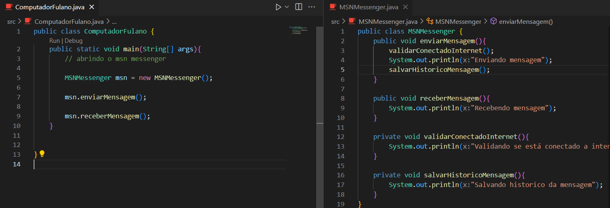
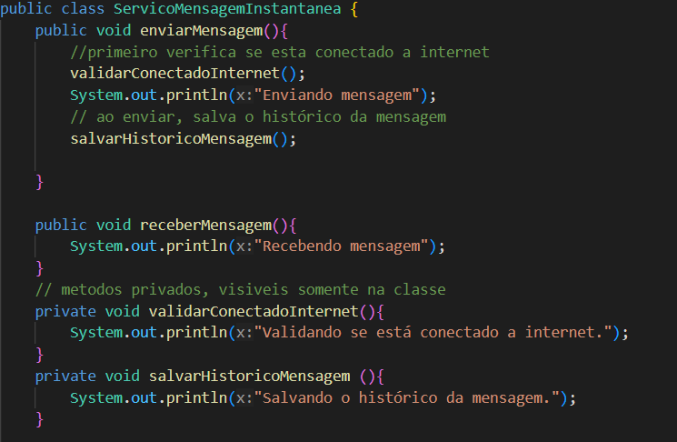
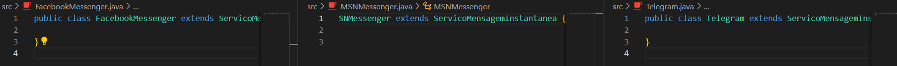
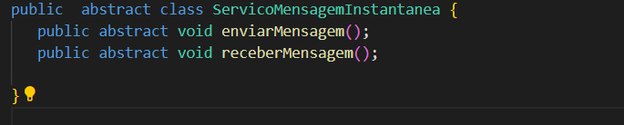
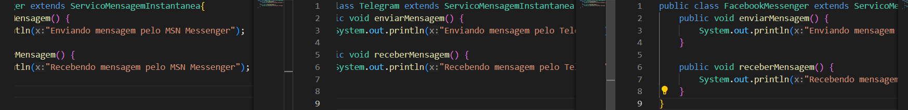
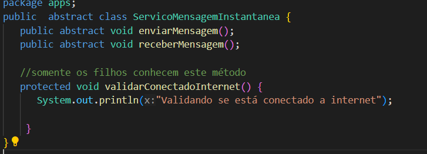
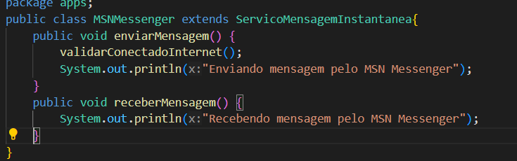

## Encapsulamento

Nesse projeto para treinar os pilares da programação orientada a objetos, vamos simular de forma basica um programa de mensagens instantaneas (MSN).

Criei a classe que será a aplicação, MSNMessenger.java, e a classe main ComputadorFulando.java.

.

Na aplicação ficou privada os metodos de validar internet e salvar historico de mensagens.
Em seguida eles são encapsulados no metodo enviar mensagem, esse processo é realizado para ocultar o algoritimo dos metodos da aplicação principal (main).

## Herança

Agora o Fulano está usando diferentes apps de mensagem instantânea, nesse caso mais genérico, todos tem o mesmo sistema de envio e recebmento de mensagens, então para evitar escrever todo algoritimo para cada classe, vamos criar um sistema "Pai" para os demais serviços.

Criei as classses de facebook e Telegram, também criei a classe ServicoMensagemInstantanea.java(classe "Pai").
Dentre dessa classe vou inserir o algoritimo e nas demais classes vou fazer elas receberem como extensão a classe pai. 

demais classes recebendo a herança.

## Abstração

Diferente da herança que a classe pai deteriminava como todos os filhos se comportariam, aqui na abstração cada filho herdara apenas o mesmo metodo, porem com formas diferentes de serem executadas. Este é um exemplo baseado pensando que uma empresa não irá fornecer seu código a outra, elas terão a mesma função, porém, metodos diferentes.

 Classe pai, agora abstrata, derteminando os metodos.

 filhos determinando seus metodos

Em Java, o conceito de abstração é representado pela palavra reservada **abstract**e métodos que NÃO possuem corpo na classe abstrata (pai).

## Polimorfismo

Um mesmo comportamento, de várias maneiras.

Podemos observar no contexto de Abstração e Herança, que conseguimos criar uma singularidade estrutural de nossos elementos. Isso quer dizer que, qualquer classe que deseja representar um serviço de mensagens, basta estender a classe
ServicoMensagemInstantanea
e implementar, os respectivos métodos abstratos. O que vale reforçar aqui é, cada classe terá a mesma ação, executando procedimentos de maneira especializada.

- Modificador protected

Vamos para uma retrospectiva, quanto ao requisito do nosso sistema de mensagens instantâneas, desde a etapa de encapsulamento.

O nosso requisito, solicita que além de Enviar e Receber Mensagens, precisamos validar se o aplicativo está conectado a internet (
validarConectadoInternet
) e salvar o histórico de cada mensagem (
salvarHistoricoMensagem
).

Sabemos que cada aplicativo, costuma salvar as mensagens em seus respectivos servidores cloud, mas e quanto validar se está conectado a internet? Não poderia ser um mecanismo comum a todos ? Logo, qualquer classe filha, de ServicoMensagemInstantanea poderia desfrutar através de herança, esta funcionalidade.

Mas fica a reflexão do que já aprendemos sobre visibilidade de recursos: Com o modificador **private**somente a classe conhece a implementação, quanto que o modificador **public**todos passarão a conhecer. Mas gostaríamos que, somente as classes filhas soubessem. Bem, é ai que entra o modificador
protected (fonte: https://glysns.gitbook.io/java-basico/programacao-orientada-a-objetos/pilares-do-poo/polimorfismo)

 incrementando o metodo protected na classe pai.

Para que o Fulano não tivesse acesso a esse metódo, foi criada uma pasta apps, e nela esta a classe pai e as classes filhas.

 Classe filha MSN utilizando o metodo protected validarConectadoInternet();.
