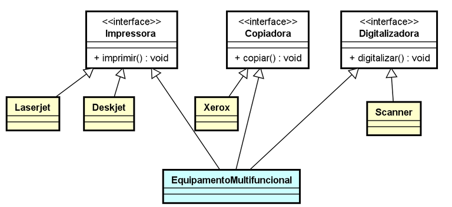
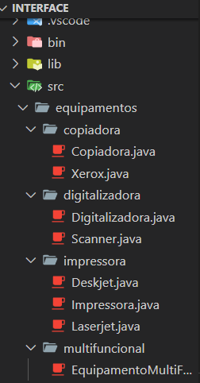
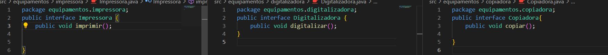
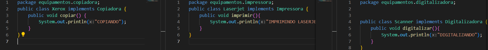
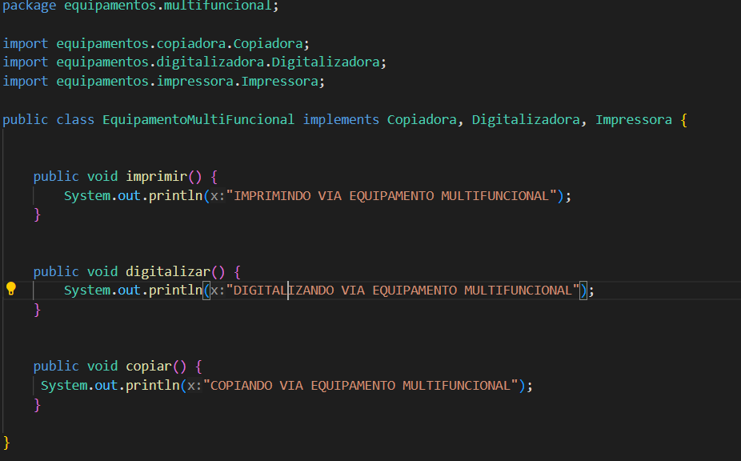
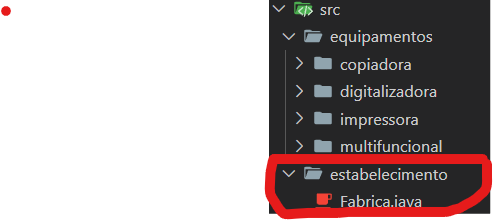
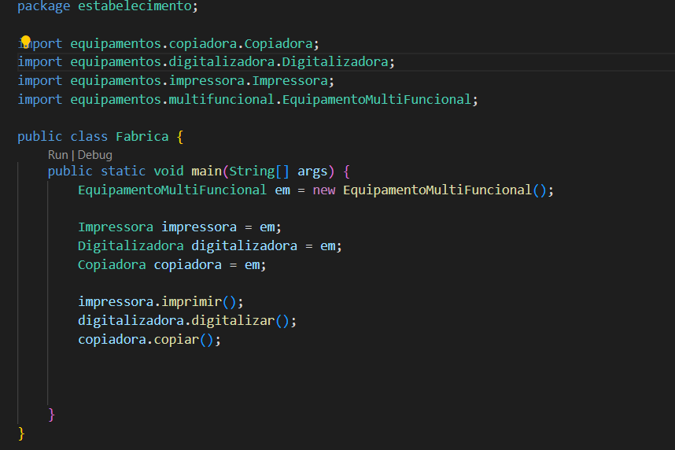
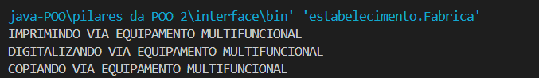

## INTERFACE

Como vimos anteriormente, Herança é um dos pilares de POO, mas uma curiosidade que se deve ser esclarecida, na linguagem Java, é que a mesma não permite o que conhecemos como Herança Múltipla.
Uma classe não pode ter vários extends, então ao invés de criar classes, crio interfaces, nas quais terão metodos abstratos. 

 Uma Copiadora, uma Digitalizadora e uma impressora, tem utilidades diferentes. Mas e um equipamento multifuncional, que tenha herde funções de cada uma? Isso seria a herança multipla. 

 diagrama de um equipamento multifuncional.

* Para esse projeto eu criei uma pasta 'equipamentos' que possui outras pastas com os respectivos equipamentos(Copiadora, Digitalizadora, Impressora, Multifuncional):

* Os Metodos principais são copiar, digitalizar e imprimir, sendo assim ao invés de criar 'publics class' vou criar 'public interface'
Cada interface publica carrega seu metodo abstrato:

Cada equipamento vai implementar sua respectiva interface e determinar seu metodo especifico:

* <strong>E o nosso equipamento Multifuncional?</strong>

Como dito antes uma classe não pode ter várias extensões, mas podemos usar o metodo 'implements' para implementar várias 'interfaces':

O equipamento multifuncional ira implementar os principais metodós em um único aparelho, determinando seu próprio metódo.

* <strong> Agora crio uma pasta 'estabelicimento' que terá A main 'Fabrica'.</strong>

Fabrica.java

criei a classe Fabrica e dentro dela criei o objeto 'em' Equipamento Multifuncional. Ele Herdará todos os metodos determinados anteriormente. Veja sua saída: 

