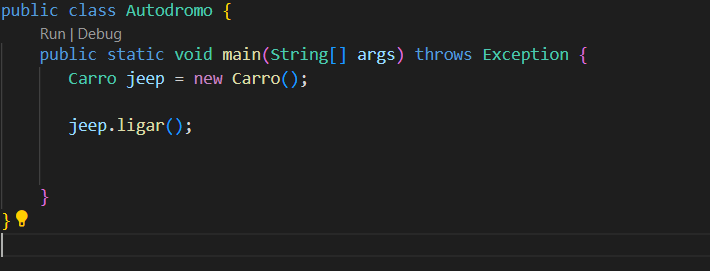
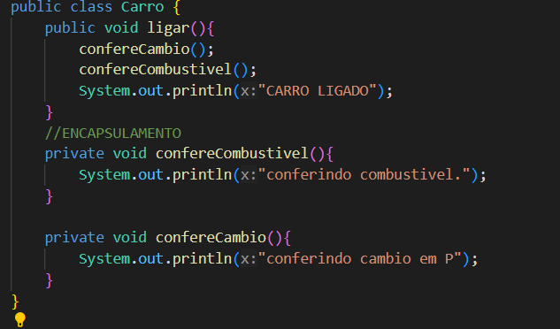
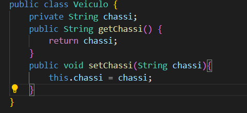

Pilares do POO
Programação orientada a objetos (POO, ou OOP segundo as suas siglas em inglês), é um paradigma de programação baseado no conceito de "objetos", que podem conter dados na forma de campos, também conhecidos como atributos e códigos, na forma de procedimentos, também conhecidos como métodos.

Como se trata de, um contexto análogo ao mundo real, tudo no qual nos referimos são objetos, exemplo: Conta bancária, Aluno, Veículo, Transferência etc.

A programação orientada a objetos, é bem requisitada no contexto das aplicações mais atuais no mercado, devido a possibilidade de reutilização de código e a capacidade de representação do sistema, ser muito mais próximo do mundo real.

Para uma linguagem ser considerada orientada a objetos, esta deve seguir o que denominamos como Os quatro pilares da orientação a objetos:

Encapsulamento: Nem tudo precisa estar visível, grande parte do nosso algoritmo pode ser distribuído em métodos, com finalidades específicas que complementam uma ação em nossa aplicação.

Exemplo: Ligar um veículo, exige muitas etapas para a engenharia, mas o condutor só visualiza a ignição, dar a partida e a “magia” acontece.

Herança: Características e comportamentos comuns, podem ser elevados e compartilhados através de uma hierarquia de objetos.

Exemplo: Um Carro e uma Motocicleta possuem propriedades como placa, chassi, ano de fabricação e métodos como acelerar e frear. Logo, para não ser um processo de codificação redundante, podemos desfrutar da herança criando uma classe Veículo para que seja herdada por Carro e Motocicleta.

Abstração: É a indisponibilidade, para determinar a lógica de um ou vários comportamentos, em um objeto.

Exemplo: Veículo\*\* \*\* determina duas ações como acelerar e frear, logo, estes comportamentos deverão ser abstratos, pois existem mais de uma maneira de se realizar a mesma operação. ver Polimorfismo.

Polimorfismo: São as inúmeras maneiras de se realizar uma mesma ação.

Exemplo: Veículo determina duas ações como acelerar e frear, primeiramente, precisamos identificar se estaremos nos referindo a Carro\*\* \*\* ou Motocicleta, para determinar a lógica de aceleração e frenagem dos respectivos veículos.

## Encapsulamento

<h2>Autodromo.java</h2>
Esse será a nossa main.
Aqui necessito apenas chamar o método ligar() que já tem encapsulado os métodos confereCambio() e confereCombustivel().

<h2>Carro.java</h2>
aqui eu crio o objeto Carro. 
Tratando de encapsulamento, nem todo o processo precisa ser verificado pelo usuário, nesse exemplo o objeto fará uma verificação automática de forma privada que é de verificar o cambio e combustivel do veiculo. O usuário necessita apenas ligar o carro.(vide código.)

## Herança

Aqui foi Criada a classe 'Veiculo' e 'Moto'. A classe veiculo vai fornecer um elemento comum entre os veiculos, nesse caso é o chassi, elemento presente em qualquer veiculo.  
 Dentro da classe veiculo criei o metodo get/set para o chassi 

 Dentro das classes moto e carro, precisei usar o metodo extends, para herdarem a classe veiculo(extends Veiculo).

## Abstração e Polimorfismo 

Tornei a classe veiculo abstrata e o metodo ligar, abstraindo assim a informação do processo para ligar o  veiculo. Desta forma tenho o polimorfismo, na qual vai determinar a ação de ligar dependendo do veiculo carro ou moto.

